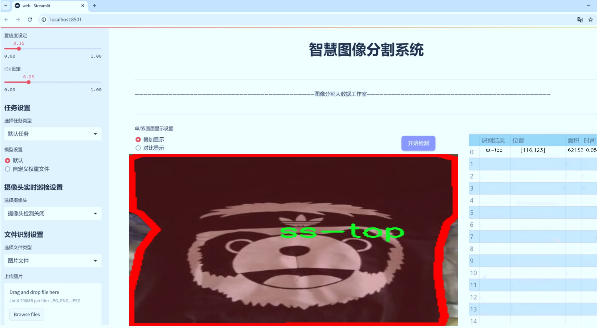
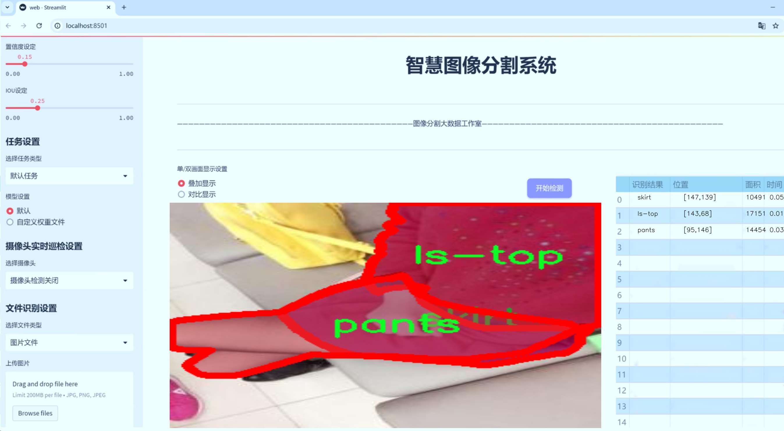
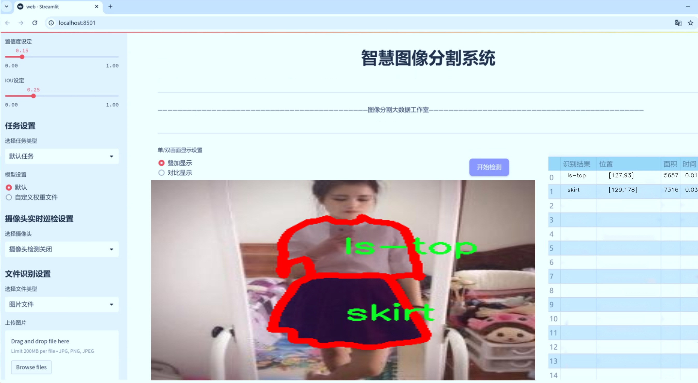
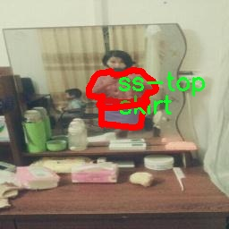
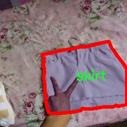
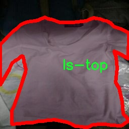
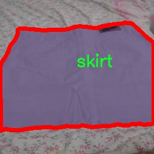
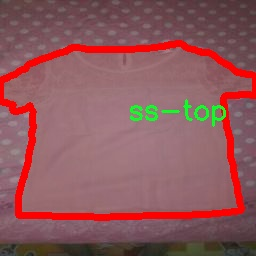

# 服装图像分割系统源码＆数据集分享
 [yolov8-seg-efficientViT＆yolov8-seg-fasternet等50+全套改进创新点发刊_一键训练教程_Web前端展示]

### 1.研究背景与意义

项目参考[ILSVRC ImageNet Large Scale Visual Recognition Challenge](https://gitee.com/YOLOv8_YOLOv11_Segmentation_Studio/projects)

项目来源[AAAI Global Al lnnovation Contest](https://kdocs.cn/l/cszuIiCKVNis)

研究背景与意义

随着互联网和社交媒体的迅猛发展，服装行业的数字化转型愈发显著。消费者对在线购物的需求不断增加，促使服装企业必须提高其产品展示的质量和效率。在这一背景下，图像处理技术，尤其是图像分割技术，成为了提升用户体验和优化产品展示的重要工具。图像分割技术能够将图像中的目标物体与背景进行有效分离，从而使得服装产品在展示时更加突出，吸引消费者的注意力。近年来，基于深度学习的目标检测和分割算法取得了显著进展，其中YOLO（You Only Look Once）系列模型因其高效性和准确性而受到广泛关注。

YOLOv8作为YOLO系列的最新版本，具备了更高的检测精度和更快的处理速度，适用于实时应用场景。然而，尽管YOLOv8在目标检测方面表现优异，但在服装图像的细粒度分割任务中仍存在一定的局限性。传统的YOLO模型主要针对物体的边界框进行检测，而服装图像分割则需要更为精细的像素级别的分割，以便于更好地展示服装的细节和轮廓。因此，基于YOLOv8的改进，构建一个专门针对服装图像的分割系统，具有重要的研究意义。

本研究将利用一个包含9900张服装图像的数据集，该数据集涵盖了11个不同的服装类别，包括长袖连衣裙、长袖夹克、上衣、裤子、短裤、裙子、短袖连衣裙、短袖夹克、短袖上衣、背心和背心连衣裙。这些类别的多样性为模型的训练提供了丰富的样本，能够有效提升模型的泛化能力。通过对这些服装图像进行细致的像素级分割，研究者可以更好地理解不同服装类别的特征和风格，从而为服装推荐系统、虚拟试衣间等应用提供技术支持。

此外，服装图像分割系统的研究不仅限于技术层面，其应用潜力也十分广泛。在电商平台中，精准的服装图像分割能够提升商品展示效果，进而提高消费者的购买意愿；在社交媒体中，服装图像的自动标注和分类可以帮助用户快速找到感兴趣的产品；在时尚行业，分析服装图像的分割结果可以为设计师提供灵感，推动时尚潮流的发展。因此，构建一个基于改进YOLOv8的服装图像分割系统，不仅具有理论研究的价值，也具备实际应用的广泛前景。

综上所述，基于改进YOLOv8的服装图像分割系统的研究，不仅能够推动计算机视觉技术在服装行业的应用发展，也将为提升消费者的购物体验和促进服装产业的数字化转型提供重要的技术支持。这一研究的开展，将为相关领域的学术研究和产业应用提供新的思路和方法，具有重要的学术价值和社会意义。

### 2.图片演示







##### 注意：由于此博客编辑较早，上面“2.图片演示”和“3.视频演示”展示的系统图片或者视频可能为老版本，新版本在老版本的基础上升级如下：（实际效果以升级的新版本为准）

  （1）适配了YOLOV8的“目标检测”模型和“实例分割”模型，通过加载相应的权重（.pt）文件即可自适应加载模型。

  （2）支持“图片识别”、“视频识别”、“摄像头实时识别”三种识别模式。

  （3）支持“图片识别”、“视频识别”、“摄像头实时识别”三种识别结果保存导出，解决手动导出（容易卡顿出现爆内存）存在的问题，识别完自动保存结果并导出到tempDir中。

  （4）支持Web前端系统中的标题、背景图等自定义修改，后面提供修改教程。

  另外本项目提供训练的数据集和训练教程,暂不提供权重文件（best.pt）,需要您按照教程进行训练后实现图片演示和Web前端界面演示的效果。

### 3.视频演示

[3.1 视频演示](https://www.bilibili.com/video/BV1Ydy3YgEXt/)

### 4.数据集信息展示

##### 4.1 本项目数据集详细数据（类别数＆类别名）

nc: 11
names: ['ls-dress', 'ls-jacket', 'ls-top', 'pants', 'shorts', 'skirt', 'ss-dress', 'ss-jacket', 'ss-top', 'vest', 'vest-dress']


##### 4.2 本项目数据集信息介绍

数据集信息展示

在本研究中，我们使用了名为“fashion”的数据集，以训练和改进YOLOv8-seg模型在服装图像分割任务中的表现。该数据集专门针对服装类别进行了精心设计，包含了11个不同的类别，旨在为计算机视觉领域的服装识别和分割提供丰富的样本和多样化的场景。数据集的类别包括：长袖连衣裙（ls-dress）、长袖夹克（ls-jacket）、长袖上衣（ls-top）、长裤（pants）、短裤（shorts）、裙子（skirt）、短袖连衣裙（ss-dress）、短袖夹克（ss-jacket）、短袖上衣（ss-top）、背心（vest）以及背心连衣裙（vest-dress）。这些类别涵盖了不同季节和风格的服装，能够有效地模拟现实生活中消费者的穿着选择。

“fashion”数据集的构建过程注重了样本的多样性和标注的准确性。每个类别的图像均经过专业人员的精确标注，确保了数据的高质量和高可靠性。这些图像不仅包含了各种不同的服装款式，还涵盖了多种背景、光照条件和拍摄角度，使得模型在训练过程中能够学习到更为复杂的特征和模式。这种多样性对于提高模型的泛化能力至关重要，因为它使得模型能够在面对未见过的图像时，依然能够做出准确的分割和识别。

在数据集的构成上，服装图像的来源广泛，既包括了专业摄影师拍摄的时尚大片，也涵盖了日常生活中的随手拍摄，确保了数据集的真实感和实用性。此外，数据集中还考虑到了不同体型、肤色和性别的多样性，力求反映出当今社会的包容性与多元化。这一方面的设计不仅提升了模型的适用性，也为后续的应用提供了更为广泛的基础。

为了进一步增强模型的训练效果，我们在数据预处理阶段对图像进行了多种增强操作，包括随机裁剪、旋转、翻转、颜色调整等。这些操作不仅增加了训练样本的数量，还有效提升了模型的鲁棒性，使其能够适应各种可能的输入变化。此外，我们还对数据集进行了划分，确保训练集、验证集和测试集的比例合理，以便于后续的模型评估和性能验证。

通过使用“fashion”数据集，我们期望能够显著提升YOLOv8-seg在服装图像分割任务中的性能，使其在实际应用中能够更好地满足用户需求。随着时尚行业对智能化、自动化的需求不断增加，基于深度学习的服装图像分割技术将发挥越来越重要的作用。我们相信，借助这一高质量的数据集，改进后的YOLOv8-seg模型将能够在复杂的服装图像分割任务中表现出色，为未来的研究和应用提供坚实的基础。











### 5.全套项目环境部署视频教程（零基础手把手教学）

[5.1 环境部署教程链接（零基础手把手教学）](https://www.bilibili.com/video/BV1jG4Ve4E9t/?vd_source=bc9aec86d164b67a7004b996143742dc)


[5.2 安装Python虚拟环境创建和依赖库安装视频教程链接（零基础手把手教学）](https://www.bilibili.com/video/BV1nA4VeYEze/?vd_source=bc9aec86d164b67a7004b996143742dc)

### 6.手把手YOLOV8-seg训练视频教程（零基础小白有手就能学会）

[6.1 手把手YOLOV8-seg训练视频教程（零基础小白有手就能学会）](https://www.bilibili.com/video/BV1cA4VeYETe/?vd_source=bc9aec86d164b67a7004b996143742dc)


按照上面的训练视频教程链接加载项目提供的数据集，运行train.py即可开始训练



     Epoch   gpu_mem       box       obj       cls    labels  img_size
     1/200     0G   0.01576   0.01955  0.007536        22      1280: 100%|██████████| 849/849 [14:42<00:00,  1.04s/it]
               Class     Images     Labels          P          R     mAP@.5 mAP@.5:.95: 100%|██████████| 213/213 [01:14<00:00,  2.87it/s]
                 all       3395      17314      0.994      0.957      0.0957      0.0843

     Epoch   gpu_mem       box       obj       cls    labels  img_size
     2/200     0G   0.01578   0.01923  0.007006        22      1280: 100%|██████████| 849/849 [14:44<00:00,  1.04s/it]
               Class     Images     Labels          P          R     mAP@.5 mAP@.5:.95: 100%|██████████| 213/213 [01:12<00:00,  2.95it/s]
                 all       3395      17314      0.996      0.956      0.0957      0.0845

     Epoch   gpu_mem       box       obj       cls    labels  img_size
     3/200     0G   0.01561    0.0191  0.006895        27      1280: 100%|██████████| 849/849 [10:56<00:00,  1.29it/s]
               Class     Images     Labels          P          R     mAP@.5 mAP@.5:.95: 100%|███████   | 187/213 [00:52<00:00,  4.04it/s]
                 all       3395      17314      0.996      0.957      0.0957      0.0845


### 7.50+种全套YOLOV8-seg创新点代码加载调参视频教程（一键加载写好的改进模型的配置文件）

[7.1 50+种全套YOLOV8-seg创新点代码加载调参视频教程（一键加载写好的改进模型的配置文件）](https://www.bilibili.com/video/BV1Hw4VePEXv/?vd_source=bc9aec86d164b67a7004b996143742dc)

### 8.YOLOV8-seg图像分割算法原理

原始YOLOv8-seg算法原理

YOLOv8-seg算法是YOLO系列中的最新版本，结合了目标检测与图像分割的功能，展现出强大的性能和灵活性。作为YOLOv8的一个重要扩展，YOLOv8-seg不仅在目标检测上进行了优化，还在语义分割方面引入了创新的设计理念，使其在处理复杂场景时能够更好地理解和分析图像内容。该算法的核心原理围绕着高效的特征提取、特征融合以及目标检测与分割的解耦设计展开。

YOLOv8-seg的整体架构可以分为四个主要部分：输入端、骨干网络（Backbone）、颈部网络（Neck）和头部网络（Head）。输入端负责对输入图像进行预处理，包括图像的缩放、增强和自适应锚框计算等操作。这些步骤确保了模型能够处理多样化的输入数据，并为后续的特征提取打下良好的基础。

在骨干网络部分，YOLOv8-seg采用了CSPDarknet结构，这一结构通过引入C2f模块，极大地增强了特征提取的能力。C2f模块通过将输入特征图分为多个分支并进行并行处理，形成了更为丰富的梯度流，进而提升了特征的表示能力。相较于前代模型，C2f模块的设计使得网络在处理复杂特征时更加高效，能够提取出更具判别性的特征信息。此外，YOLOv8-seg还引入了快速空间金字塔池化（SPPF）结构，能够有效地提取不同尺度的特征，增强了模型对多尺度目标的适应能力。

颈部网络部分采用了特征金字塔网络（FPN）与路径聚合网络（PAN）的结合，进一步加强了不同尺度特征的融合能力。通过这种结构，YOLOv8-seg能够在不同层次上捕捉到语义信息和定位信息，从而提高对目标的检测精度。特征融合的过程使得模型能够更好地理解图像中的上下文信息，尤其是在复杂场景中，能够有效地分离前景与背景，提高分割的准确性。

在头部网络部分，YOLOv8-seg采用了解耦的设计理念，将分类和回归过程分开进行。这一设计不仅提高了模型的训练效率，还使得目标检测与图像分割的任务能够更为独立地进行优化。YOLOv8-seg通过使用Task-Aligned Assigner策略，结合二元交叉熵损失（BCELoss）和分布焦点损失（DFLoss），实现了对正负样本的有效分配，从而提升了模型对边界框和分割掩码的预测精度。

值得注意的是，YOLOv8-seg在目标检测方面采用了无锚框（Anchor-Free）的检测方式，这一创新的设计减少了对锚框的依赖，使得模型在处理目标时更加灵活和高效。通过直接预测目标的中心点和宽高比例，YOLOv8-seg能够在保证检测精度的同时，显著提高检测速度。这一特性在实时应用场景中尤为重要，能够满足对速度和准确度的双重需求。

此外，YOLOv8-seg在处理图像分割任务时，通过对特征图的细致处理，能够生成高质量的分割掩码。这一过程涉及到对特征图的进一步细化和增强，使得模型能够在分割边界处表现出更高的精度。通过将目标检测与图像分割相结合，YOLOv8-seg不仅能够识别目标的位置，还能够提供目标的精确形状信息，这对于许多应用场景，如自动驾驶、医学影像分析等，具有重要的实际意义。

总的来说，YOLOv8-seg算法通过其创新的网络结构和高效的特征处理机制，展现了在目标检测与图像分割领域的强大能力。其无锚框的检测方式、解耦的头部设计以及丰富的特征融合策略，使得YOLOv8-seg在复杂场景下的表现优于前代模型。随着YOLOv8-seg的不断发展与优化，未来在各类计算机视觉任务中，它有望成为一个更加重要的工具，推动相关领域的研究与应用进展。


### 9.系统功能展示（检测对象为举例，实际内容以本项目数据集为准）

图9.1.系统支持检测结果表格显示

  图9.2.系统支持置信度和IOU阈值手动调节

  图9.3.系统支持自定义加载权重文件best.pt(需要你通过步骤5中训练获得)

  图9.4.系统支持摄像头实时识别

  图9.5.系统支持图片识别

  图9.6.系统支持视频识别

  图9.7.系统支持识别结果文件自动保存

  图9.8.系统支持Excel导出检测结果数据


### 10.50+种全套YOLOV8-seg创新点原理讲解（非科班也可以轻松写刊发刊，V11版本正在科研待更新）

#### 10.1 由于篇幅限制，每个创新点的具体原理讲解就不一一展开，具体见下列网址中的创新点对应子项目的技术原理博客网址【Blog】：


[10.1 50+种全套YOLOV8-seg创新点原理讲解链接](https://gitee.com/qunmasj/good)

#### 10.2 部分改进模块原理讲解(完整的改进原理见上图和技术博客链接)【如果此小节的图加载失败可以通过CSDN或者Github搜索该博客的标题访问原始博客，原始博客图片显示正常】
### YOLOv8简介
YOLOv8 尚未发表论文，因此我们无法直接了解其创建过程中进行的直接研究方法和消融研究。话虽如此，我们分析了有关模型的存储库和可用信息，以开始记录 YOLOv8 中的新功能。

如果您想自己查看代码，请查看YOLOv8 存储库并查看此代码差异以了解一些研究是如何完成的。

在这里，我们提供了有影响力的模型更新的快速总结，然后我们将查看模型的评估，这不言自明。

GitHub 用户 RangeKing 制作的下图显示了网络架构的详细可视化。


在这里插入图片描述


在这里插入图片描述

YOLOv8 架构，GitHub 用户 RangeKing 制作的可视化

无锚检测
YOLOv8 是一个无锚模型。这意味着它直接预测对象的中心而不是已知锚框的偏移量。


YOLO中anchor box的可视化

锚框是早期 YOLO 模型中众所周知的棘手部分，因为它们可能代表目标基准框的分布，而不是自定义数据集的分布。


YOLOv8 的检测头，在netron.app中可视化

Anchor free 检测减少了框预测的数量，从而加速了非最大抑制 (NMS)，这是一个复杂的后处理步骤，在推理后筛选候选检测。


YOLOv8 的检测头，在netron.app中可视化

新的卷积
stem 的第一个6x6conv 被替换为 a 3x3，主要构建块被更改，并且C2f替换了C3。该模块总结如下图，其中“f”是特征数，“e”是扩展率，CBS是由a Conv、a BatchNorm、a组成的block SiLU。

在中， （两个具有剩余连接的 3x3C2f的奇特名称）的所有输出都被连接起来。而在仅使用最后一个输出。Bottleneck``convs``C3``Bottleneck


新的 YOLOv8C2f模块

这Bottleneck与 YOLOv5 中的相同，但第一个 conv 的内核大小从更改1x1为3x3. 从这些信息中，我们可以看到 YOLOv8 开始恢复到 2015 年定义的 ResNet 块。

在颈部，特征直接连接而不强制使用相同的通道尺寸。这减少了参数数量和张量的整体大小。

### 空间和通道重建卷积SCConv
参考该博客提出的一种高效的卷积模块，称为SCConv (spatial and channel reconstruction convolution)，以减少冗余计算并促进代表性特征的学习。提出的SCConv由空间重构单元(SRU)和信道重构单元(CRU)两个单元组成。

（1）SRU根据权重分离冗余特征并进行重构，以抑制空间维度上的冗余，增强特征的表征。

（2）CRU采用分裂变换和融合策略来减少信道维度的冗余以及计算成本和存储。

（3）SCConv是一种即插即用的架构单元，可直接用于替代各种卷积神经网络中的标准卷积。实验结果表明，scconvo嵌入模型能够通过减少冗余特征来获得更好的性能，并且显著降低了复杂度和计算成本。


SCConv如图所示，它由两个单元组成，空间重建单元(SRU)和通道重建单元(CRU)，以顺序的方式放置。具体而言，对于瓶颈残差块中的中间输入特征X，首先通过SRU运算获得空间细化特征Xw，然后利用CRU运算获得信道细化特征Y。SCConv模块充分利用了特征之间的空间冗余和通道冗余，可以无缝集成到任何CNN架构中，以减少中间特征映射之间的冗余并增强CNN的特征表示。

#### SRU单元用于空间冗余


为了利用特征的空间冗余，引入了空间重构单元(SRU)，如图2所示，它利用了分离和重构操作。

分离操作 的目的是将信息丰富的特征图与空间内容对应的信息较少的特征图分离开来。我们利用组归一化(GN)层中的比例因子来评估不同特征图的信息内容。具体来说，给定一个中间特征映射X∈R N×C×H×W，首先通过减去平均值µ并除以标准差σ来标准化输入特征X，如下所示:


其中µ和σ是X的均值和标准差，ε是为了除法稳定性而加入的一个小的正常数，γ和β是可训练的仿射变换。

GN层中的可训练参数\gamma \in R^{C}用于测量每个批次和通道的空间像素方差。更丰富的空间信息反映了空间像素的更多变化，从而导致更大的γ。归一化相关权重W_{\gamma} \in R^{C}由下面公式2得到，表示不同特征映射的重要性。


然后将经Wγ重新加权的特征映射的权值通过sigmoid函数映射到(0,1)范围，并通过阈值进行门控。我们将阈值以上的权重设置为1，得到信息权重W1，将其设置为0，得到非信息权重W2(实验中阈值设置为0.5)。获取W的整个过程可以用公式表示。


最后将输入特征X分别乘以W1和W2，得到两个加权特征:信息量较大的特征X_{1}^{\omega }和信息量较小的特征X_{2}^{\omega }。这样就成功地将输入特征分为两部分:X_{1}^{\omega }具有信息量和表达性的空间内容，而X_{2}^{\omega }几乎没有信息，被认为是冗余的。

重构操作 将信息丰富的特征与信息较少的特征相加，生成信息更丰富的特征，从而节省空间空间。采用交叉重构运算，将加权后的两个不同的信息特征充分结合起来，加强它们之间的信息流。然后将交叉重构的特征X^{\omega1}和X^{\omega2}进行拼接，得到空间精细特征映射X^{\omega}。从后过程表示如下：


其中⊗是逐元素的乘法，⊕是逐元素的求和，∪是串联。将SRU应用于中间输入特征X后，不仅将信息特征与信息较少的特征分离，而且对其进行重构，增强代表性特征，抑制空间维度上的冗余特征。然而，空间精细特征映射X^{\omega}在通道维度上仍然是冗余的。

#### CRU单元用于通道冗余


分割 操作将输入的空间细化特征X^{\omega}分割成两个部分，一部分通道数是\alpha C，另一部分通道数是(1-\alpha) C，随后对两组特征的通道数使用1 * 1卷积核进行压缩，分别得到X_{up}和X_{low}。

转换 操作将输入的X_{up}作为“富特征提取”的输入，分别进行GWC和PWC，然后相加得到输出Y1，将输入X_{low}作为“富特征提取”的补充，进行PWC，得到的记过和原来的输入取并集得到Y2。

融合 操作使用简化的SKNet方法来自适应合并Y1和Y2。具体说是首先使用全局平均池化将全局空间信息和通道统计信息结合起来，得到经过池化的S1和S2。然后对S1和S2做Softmax得到特征权重向量\beta _{1}和\beta _{2}，最后使用特征权重向量得到输出Y = \beta _{1}*Y_{1} + \beta _{2}*Y_{2}，Y即为通道提炼的特征。


### 11.项目核心源码讲解（再也不用担心看不懂代码逻辑）

#### 11.1 ultralytics\nn\backbone\CSwomTramsformer.py

以下是经过精简和注释的核心代码部分，主要保留了 CSWin Transformer 的结构和功能实现。

```python
import torch
import torch.nn as nn
import numpy as np

class Mlp(nn.Module):
    """多层感知机（MLP）模块"""
    def __init__(self, in_features, hidden_features=None, out_features=None, act_layer=nn.GELU, drop=0.):
        super().__init__()
        out_features = out_features or in_features  # 输出特征数
        hidden_features = hidden_features or in_features  # 隐藏层特征数
        self.fc1 = nn.Linear(in_features, hidden_features)  # 第一层线性变换
        self.act = act_layer()  # 激活函数
        self.fc2 = nn.Linear(hidden_features, out_features)  # 第二层线性变换
        self.drop = nn.Dropout(drop)  # Dropout层

    def forward(self, x):
        """前向传播"""
        x = self.fc1(x)
        x = self.act(x)
        x = self.drop(x)
        x = self.fc2(x)
        x = self.drop(x)
        return x

class LePEAttention(nn.Module):
    """局部增强位置编码注意力模块"""
    def __init__(self, dim, resolution, num_heads, split_size=7, attn_drop=0.):
        super().__init__()
        self.dim = dim  # 输入特征维度
        self.resolution = resolution  # 输入分辨率
        self.split_size = split_size  # 切分窗口大小
        self.num_heads = num_heads  # 注意力头数
        head_dim = dim // num_heads  # 每个头的维度
        self.scale = head_dim ** -0.5  # 缩放因子
        self.get_v = nn.Conv2d(dim, dim, kernel_size=3, stride=1, padding=1, groups=dim)  # 用于计算v的卷积层
        self.attn_drop = nn.Dropout(attn_drop)  # 注意力Dropout层

    def im2cswin(self, x):
        """将输入张量转换为窗口格式"""
        B, N, C = x.shape
        H = W = int(np.sqrt(N))  # 计算高度和宽度
        x = x.transpose(-2, -1).contiguous().view(B, C, H, W)  # 转换维度
        # 切分为窗口
        x = img2windows(x, self.split_size, self.split_size)
        return x

    def forward(self, qkv):
        """前向传播"""
        q, k, v = qkv  # 拆分查询、键、值
        q = self.im2cswin(q)  # 将q转换为窗口格式
        k = self.im2cswin(k)  # 将k转换为窗口格式
        v = self.get_v(v)  # 计算v
        q = q * self.scale  # 缩放q
        attn = (q @ k.transpose(-2, -1))  # 计算注意力权重
        attn = nn.functional.softmax(attn, dim=-1)  # softmax归一化
        attn = self.attn_drop(attn)  # 应用Dropout
        x = attn @ v  # 加权求和
        return x

class CSWinBlock(nn.Module):
    """CSWin Transformer的基本模块"""
    def __init__(self, dim, num_heads, split_size=7):
        super().__init__()
        self.qkv = nn.Linear(dim, dim * 3)  # 线性变换生成q、k、v
        self.attn = LePEAttention(dim, resolution=split_size, num_heads=num_heads)  # 注意力模块
        self.norm1 = nn.LayerNorm(dim)  # 归一化层
        self.mlp = Mlp(in_features=dim, hidden_features=dim * 4)  # MLP模块
        self.norm2 = nn.LayerNorm(dim)  # 归一化层

    def forward(self, x):
        """前向传播"""
        x = self.norm1(x)  # 归一化
        qkv = self.qkv(x).reshape(x.shape[0], -1, 3, x.shape[2]).permute(2, 0, 1, 3)  # 生成q、k、v
        x = self.attn(qkv)  # 计算注意力
        x = x + self.norm2(x)  # 残差连接和归一化
        x = x + self.mlp(x)  # 残差连接和MLP
        return x

class CSWinTransformer(nn.Module):
    """CSWin Transformer模型"""
    def __init__(self, img_size=640, in_chans=3, num_classes=1000, embed_dim=96, depth=[2, 2, 6, 2], num_heads=12):
        super().__init__()
        self.stage1_conv_embed = nn.Sequential(
            nn.Conv2d(in_chans, embed_dim, kernel_size=7, stride=4, padding=2),  # 输入卷积层
            nn.LayerNorm(embed_dim)  # 归一化层
        )
        self.stage1 = nn.ModuleList([CSWinBlock(embed_dim, num_heads) for _ in range(depth[0])])  # 第一阶段
        # 后续阶段和合并模块省略，保持结构一致

    def forward(self, x):
        """前向传播"""
        x = self.stage1_conv_embed(x)  # 输入卷积嵌入
        for blk in self.stage1:
            x = blk(x)  # 逐块前向传播
        return x

# 模型实例化与测试
if __name__ == '__main__':
    inputs = torch.randn((1, 3, 640, 640))  # 随机输入
    model = CSWinTransformer()  # 实例化模型
    res = model(inputs)  # 前向传播
    print(res.size())  # 输出结果尺寸
```

### 代码注释说明：
1. **Mlp类**：实现了一个简单的多层感知机，包括两个线性层和一个激活函数。
2. **LePEAttention类**：实现了局部增强位置编码的注意力机制，负责计算输入的注意力权重。
3. **CSWinBlock类**：实现了CSWin Transformer的基本构建块，包含注意力层和MLP层。
4. **CSWinTransformer类**：整体模型的定义，包含多个CSWinBlock模块，处理输入图像并生成特征。

### 注意：
- 代码中省略了一些细节和后续阶段的实现，保留了主要的结构和功能。
- 每个类和方法都有详细的中文注释，帮助理解其功能和实现。

该文件实现了CSWin Transformer模型，这是一个用于计算机视觉任务的深度学习模型，特别是在图像分类等任务中表现出色。代码中包含了多个类和函数，构成了整个模型的结构。

首先，文件导入了必要的库，包括PyTorch和一些用于模型构建的工具，如线性层、卷积层、Dropout等。接着，定义了几个模型的基本组件，包括多层感知机（Mlp）、LePE注意力机制、CSWin块（CSWinBlock）和合并块（Merge_Block）。

Mlp类是一个简单的前馈神经网络，由两个线性层和一个激活函数（默认为GELU）组成，支持Dropout。LePEAttention类实现了一种特殊的注意力机制，能够将输入图像分割成窗口，并在这些窗口之间计算注意力。它支持多头注意力，并且在计算注意力时使用了分辨率和窗口大小的参数。

CSWinBlock类是模型的核心构建块，包含了LePE注意力机制和多层感知机。它将输入进行归一化处理，然后通过线性层生成查询、键和值，接着调用LePEAttention进行注意力计算，最后通过多层感知机进行特征变换。

文件中还定义了img2windows和windows2img函数，用于在图像和窗口之间进行转换，方便注意力机制的计算。Merge_Block类用于在不同阶段之间合并特征，通常在特征维度上进行卷积操作。

CSWinTransformer类是整个模型的主体，负责构建不同的阶段，每个阶段由多个CSWinBlock组成。模型的输入经过初始的卷积嵌入层后，依次通过各个阶段进行处理。每个阶段后面都有一个Merge_Block，用于合并特征并调整维度。

在模型的初始化过程中，使用了不同的参数来定义每个阶段的深度、头数和其他超参数。模型的权重初始化使用了trunc_normal_函数，以确保训练时的稳定性。

此外，文件还提供了几个函数，用于加载预训练权重并更新模型的权重。最后，文件的主程序部分创建了不同规模的CSWin Transformer模型（如CSWin_tiny、CSWin_small等），并对随机生成的输入进行前向传播，输出每个模型的特征尺寸。

整体来看，该文件实现了一个结构复杂但功能强大的视觉Transformer模型，适用于多种计算机视觉任务，且具备灵活的配置选项。

#### 11.2 ultralytics\models\yolo\segment\val.py

以下是代码中最核心的部分，并附上详细的中文注释：

```python
class SegmentationValidator(DetectionValidator):
    """
    扩展DetectionValidator类的SegmentationValidator类，用于基于分割模型的验证。
    """

    def __init__(self, dataloader=None, save_dir=None, pbar=None, args=None, _callbacks=None):
        """初始化SegmentationValidator，并将任务设置为'segment'，指标设置为SegmentMetrics。"""
        super().__init__(dataloader, save_dir, pbar, args, _callbacks)
        self.plot_masks = None  # 用于存储绘制的掩膜
        self.process = None  # 处理掩膜的函数
        self.args.task = 'segment'  # 设置任务类型为分割
        self.metrics = SegmentMetrics(save_dir=self.save_dir, on_plot=self.on_plot)  # 初始化指标

    def preprocess(self, batch):
        """预处理批次，将掩膜转换为浮点数并发送到设备。"""
        batch = super().preprocess(batch)  # 调用父类的预处理方法
        batch['masks'] = batch['masks'].to(self.device).float()  # 将掩膜转换为浮点数并移动到指定设备
        return batch

    def postprocess(self, preds):
        """后处理YOLO预测，返回输出检测和原型。"""
        p = ops.non_max_suppression(preds[0],  # 进行非极大值抑制
                                    self.args.conf,
                                    self.args.iou,
                                    labels=self.lb,
                                    multi_label=True,
                                    agnostic=self.args.single_cls,
                                    max_det=self.args.max_det,
                                    nc=self.nc)
        proto = preds[1][-1] if len(preds[1]) == 3 else preds[1]  # 获取原型
        return p, proto  # 返回处理后的预测和原型

    def update_metrics(self, preds, batch):
        """更新指标。"""
        for si, (pred, proto) in enumerate(zip(preds[0], preds[1])):  # 遍历每个预测
            idx = batch['batch_idx'] == si  # 获取当前批次的索引
            cls = batch['cls'][idx]  # 获取当前批次的类别
            bbox = batch['bboxes'][idx]  # 获取当前批次的边界框
            nl, npr = cls.shape[0], pred.shape[0]  # 标签和预测的数量
            shape = batch['ori_shape'][si]  # 获取原始形状
            correct_masks = torch.zeros(npr, self.niou, dtype=torch.bool, device=self.device)  # 初始化正确掩膜
            correct_bboxes = torch.zeros(npr, self.niou, dtype=torch.bool, device=self.device)  # 初始化正确边界框
            self.seen += 1  # 增加已处理的样本数量

            if npr == 0:  # 如果没有预测
                if nl:  # 如果有标签
                    self.stats.append((correct_bboxes, correct_masks, *torch.zeros((2, 0), device=self.device), cls.squeeze(-1)))
                continue  # 继续下一个循环

            # 处理掩膜
            midx = [si] if self.args.overlap_mask else idx  # 根据重叠掩膜的参数选择索引
            gt_masks = batch['masks'][midx]  # 获取真实掩膜
            pred_masks = self.process(proto, pred[:, 6:], pred[:, :4], shape=batch['img'][si].shape[1:])  # 处理预测掩膜

            # 处理边界框预测
            if self.args.single_cls:
                pred[:, 5] = 0  # 如果是单类，设置类别为0
            predn = pred.clone()  # 克隆预测
            ops.scale_boxes(batch['img'][si].shape[1:], predn[:, :4], shape, ratio_pad=batch['ratio_pad'][si])  # 缩放边界框

            # 评估
            if nl:  # 如果有标签
                height, width = batch['img'].shape[2:]  # 获取图像的高度和宽度
                tbox = ops.xywh2xyxy(bbox) * torch.tensor((width, height, width, height), device=self.device)  # 转换为xyxy格式
                ops.scale_boxes(batch['img'][si].shape[1:], tbox, shape, ratio_pad=batch['ratio_pad'][si])  # 缩放标签
                labelsn = torch.cat((cls, tbox), 1)  # 合并类别和边界框
                correct_bboxes = self._process_batch(predn, labelsn)  # 处理边界框
                correct_masks = self._process_batch(predn, labelsn, pred_masks, gt_masks, overlap=self.args.overlap_mask, masks=True)  # 处理掩膜
                if self.args.plots:
                    self.confusion_matrix.process_batch(predn, labelsn)  # 更新混淆矩阵

            # 添加正确的掩膜和边界框到统计数据
            self.stats.append((correct_bboxes, correct_masks, pred[:, 4], pred[:, 5], cls.squeeze(-1)))

    def finalize_metrics(self, *args, **kwargs):
        """设置评估指标的速度和混淆矩阵。"""
        self.metrics.speed = self.speed  # 设置速度
        self.metrics.confusion_matrix = self.confusion_matrix  # 设置混淆矩阵

    def _process_batch(self, detections, labels, pred_masks=None, gt_masks=None, overlap=False, masks=False):
        """
        返回正确预测矩阵。

        参数:
            detections (array[N, 6]), x1, y1, x2, y2, conf, class
            labels (array[M, 5]), class, x1, y1, x2, y2

        返回:
            correct (array[N, 10]), 对于10个IoU级别
        """
        if masks:  # 如果处理掩膜
            if overlap:  # 如果考虑重叠
                nl = len(labels)
                index = torch.arange(nl, device=gt_masks.device).view(nl, 1, 1) + 1
                gt_masks = gt_masks.repeat(nl, 1, 1)  # 重复真实掩膜
                gt_masks = torch.where(gt_masks == index, 1.0, 0.0)  # 处理掩膜
            if gt_masks.shape[1:] != pred_masks.shape[1:]:  # 如果形状不匹配
                gt_masks = F.interpolate(gt_masks[None], pred_masks.shape[1:], mode='bilinear', align_corners=False)[0]  # 插值调整大小
                gt_masks = gt_masks.gt_(0.5)  # 转换为二值掩膜
            iou = mask_iou(gt_masks.view(gt_masks.shape[0], -1), pred_masks.view(pred_masks.shape[0], -1))  # 计算IoU
        else:  # 如果处理边界框
            iou = box_iou(labels[:, 1:], detections[:, :4])  # 计算边界框的IoU

        return self.match_predictions(detections[:, 5], labels[:, 0], iou)  # 匹配预测和标签

    def plot_predictions(self, batch, preds, ni):
        """绘制批次预测的掩膜和边界框。"""
        plot_images(
            batch['img'],
            *output_to_target(preds[0], max_det=15),  # 输出目标
            torch.cat(self.plot_masks, dim=0) if len(self.plot_masks) else self.plot_masks,
            paths=batch['im_file'],
            fname=self.save_dir / f'val_batch{ni}_pred.jpg',
            names=self.names,
            on_plot=self.on_plot)  # 绘制预测
        self.plot_masks.clear()  # 清空绘制的掩膜
```

### 代码核心部分说明：
1. **SegmentationValidator类**：这是一个用于处理分割任务的验证器，继承自DetectionValidator。
2. **初始化方法**：设置任务类型为分割，并初始化指标。
3. **预处理方法**：将输入批次中的掩膜转换为浮点数并移动到指定设备。
4. **后处理方法**：对YOLO模型的预测结果进行后处理，应用非极大值抑制以获得最终的检测结果。
5. **更新指标方法**：计算和更新当前批次的指标，包括掩膜和边界框的正确性。
6. **最终化指标方法**：设置评估指标的速度和混淆矩阵。
7. **处理批次方法**：计算预测与真实标签之间的IoU，并返回正确的预测矩阵。
8. **绘制预测方法**：将预测结果绘制出来，包括掩膜和边界框。

这些核心部分构成了分割验证器的主要功能，确保模型的预测结果能够被正确评估和可视化。

这个程序文件 `val.py` 是 Ultralytics YOLO 模型的一部分，专门用于基于分割模型的验证。它继承自 `DetectionValidator` 类，主要用于处理图像分割任务的验证过程。

首先，程序导入了一些必要的库，包括多线程处理、路径操作、NumPy 和 PyTorch。接着，定义了一个 `SegmentationValidator` 类，该类用于初始化验证器并设置任务为“分割”。在构造函数中，调用了父类的构造函数，并初始化了一些特定于分割的参数，比如 `plot_masks` 和 `process`，同时还创建了一个用于计算分割指标的 `SegmentMetrics` 实例。

在 `preprocess` 方法中，输入的批次数据会被处理，将掩码转换为浮点数并发送到指定的设备上。在 `init_metrics` 方法中，初始化指标并根据是否保存 JSON 文件来选择掩码处理函数。

`get_desc` 方法返回格式化的评估指标描述，方便在输出中查看。`postprocess` 方法则对 YOLO 的预测结果进行后处理，返回输出检测结果和原型数据。

`update_metrics` 方法是核心部分之一，它会遍历每个预测结果并与真实标签进行比较，计算正确的掩码和边界框。该方法还会处理掩码的预测和真实值，计算它们的交并比（IoU），并更新统计数据。

`finalize_metrics` 方法用于设置评估指标的速度和混淆矩阵。`_process_batch` 方法则用于返回正确的预测矩阵，支持处理掩码和边界框。

`plot_val_samples` 和 `plot_predictions` 方法用于可视化验证样本和预测结果，生成带有边界框和掩码的图像。`pred_to_json` 方法将预测结果保存为 JSON 格式，适用于 COCO 数据集的评估。

最后，`eval_json` 方法用于返回 COCO 风格的目标检测评估指标，如果保存了 JSON 文件且存在标注数据，它会使用 pycocotools 进行评估，并输出 mAP 等指标。

整体来看，这个文件的主要功能是处理图像分割模型的验证过程，包括数据预处理、指标计算、结果可视化和评估。通过合理的类设计和方法划分，使得代码结构清晰，易于维护和扩展。

#### 11.3 ui.py

以下是经过简化并添加详细中文注释的核心代码部分：

```python
import sys
import subprocess

def run_script(script_path):
    """
    使用当前 Python 环境运行指定的脚本。

    Args:
        script_path (str): 要运行的脚本路径

    Returns:
        None
    """
    # 获取当前 Python 解释器的路径
    python_path = sys.executable

    # 构建运行命令，使用 streamlit 运行指定的脚本
    command = f'"{python_path}" -m streamlit run "{script_path}"'

    # 执行命令
    result = subprocess.run(command, shell=True)
    
    # 检查命令执行结果，如果返回码不为0，则表示出错
    if result.returncode != 0:
        print("脚本运行出错。")

# 实例化并运行应用
if __name__ == "__main__":
    # 指定要运行的脚本路径
    script_path = "web.py"  # 这里可以直接指定脚本名称，假设它在当前目录下

    # 调用函数运行脚本
    run_script(script_path)
```

### 代码注释说明：
1. **导入模块**：
   - `sys`：用于获取当前 Python 解释器的路径。
   - `subprocess`：用于执行外部命令。

2. **`run_script` 函数**：
   - 该函数接收一个脚本路径作为参数，并使用当前 Python 环境运行该脚本。
   - 使用 `sys.executable` 获取当前 Python 解释器的路径。
   - 构建一个命令字符串，该命令使用 `streamlit` 模块运行指定的脚本。
   - 使用 `subprocess.run` 执行构建的命令，并检查返回码以判断脚本是否成功运行。

3. **主程序块**：
   - 在主程序块中，指定要运行的脚本路径（这里假设脚本在当前目录下）。
   - 调用 `run_script` 函数以执行指定的脚本。

这个程序文件名为 `ui.py`，其主要功能是通过当前的 Python 环境运行一个指定的脚本。程序首先导入了必要的模块，包括 `sys`、`os` 和 `subprocess`，以及一个自定义的路径处理模块 `abs_path`。

在程序中定义了一个名为 `run_script` 的函数，该函数接受一个参数 `script_path`，表示要运行的脚本的路径。函数内部首先获取当前 Python 解释器的路径，并将其存储在 `python_path` 变量中。接着，构建一个命令字符串，该命令使用 `streamlit` 模块来运行指定的脚本。具体来说，命令格式为 `"{python_path}" -m streamlit run "{script_path}"`，这意味着使用当前的 Python 解释器来执行 `streamlit` 的运行命令。

随后，程序使用 `subprocess.run` 方法来执行构建好的命令，并将 `shell` 参数设置为 `True`，以便在 shell 环境中运行命令。执行完命令后，程序检查返回的结果代码，如果返回代码不为零，表示脚本运行出错，程序会打印出相应的错误信息。

在文件的最后部分，程序通过 `if __name__ == "__main__":` 判断当前模块是否为主程序，如果是，则指定要运行的脚本路径为 `web.py`，并调用 `run_script` 函数来执行该脚本。这里的 `abs_path` 函数用于获取 `web.py` 的绝对路径，确保脚本能够被正确找到并执行。

总体来说，这个程序的主要目的是提供一个简单的接口，通过命令行运行一个 Streamlit 应用脚本，方便用户在当前 Python 环境中启动 Web 应用。

#### 11.4 ultralytics\utils\files.py

以下是经过简化和注释的核心代码部分：

```python
import os
from pathlib import Path
from datetime import datetime

def increment_path(path, exist_ok=False, sep='', mkdir=False):
    """
    增加文件或目录路径的序号，例如将 'runs/exp' 增加为 'runs/exp_2', 'runs/exp_3' 等。

    参数:
        path (str, pathlib.Path): 要增加的路径。
        exist_ok (bool, optional): 如果为 True，则返回原路径，不进行增加。默认为 False。
        sep (str, optional): 在路径和序号之间使用的分隔符。默认为 ''。
        mkdir (bool, optional): 如果路径不存在，则创建目录。默认为 False。

    返回:
        (pathlib.Path): 增加后的路径。
    """
    path = Path(path)  # 将路径转换为 Path 对象，确保跨平台兼容
    if path.exists() and not exist_ok:
        # 如果路径存在且 exist_ok 为 False，进行路径增加
        path, suffix = (path.with_suffix(''), path.suffix) if path.is_file() else (path, '')

        # 方法：从 2 开始循环增加序号
        for n in range(2, 9999):
            p = f'{path}{sep}{n}{suffix}'  # 生成新的路径
            if not os.path.exists(p):  # 检查新路径是否存在
                break
        path = Path(p)  # 更新路径为新的路径

    if mkdir:
        path.mkdir(parents=True, exist_ok=True)  # 如果 mkdir 为 True，创建目录

    return path  # 返回增加后的路径


def file_age(path):
    """返回文件自上次更新以来的天数。"""
    dt = (datetime.now() - datetime.fromtimestamp(Path(path).stat().st_mtime))  # 计算时间差
    return dt.days  # 返回天数


def file_size(path):
    """返回文件或目录的大小（以 MB 为单位）。"""
    if isinstance(path, (str, Path)):
        mb = 1 << 20  # 将字节转换为 MB (1024 ** 2)
        path = Path(path)
        if path.is_file():
            return path.stat().st_size / mb  # 返回文件大小
        elif path.is_dir():
            # 返回目录下所有文件的总大小
            return sum(f.stat().st_size for f in path.glob('**/*') if f.is_file()) / mb
    return 0.0  # 如果路径无效，返回 0.0
```

### 代码注释说明：
1. **increment_path**: 该函数用于增加文件或目录的路径后缀，以避免路径冲突。它会检查路径是否存在，如果存在，则在路径后添加一个序号。可以选择创建目录。
  
2. **file_age**: 该函数计算并返回文件自上次修改以来的天数，使用文件的最后修改时间与当前时间进行比较。

3. **file_size**: 该函数返回指定文件或目录的大小（以 MB 为单位）。对于文件，直接返回其大小；对于目录，计算目录下所有文件的总大小。

这个程序文件 `ultralytics/utils/files.py` 是一个用于处理文件和目录的实用工具模块，主要包含一些与文件操作相关的功能，适用于 Ultralytics YOLO 项目。以下是对文件中各个部分的详细说明。

首先，文件导入了一些必要的模块，包括 `contextlib`、`glob`、`os`、`shutil`、`tempfile`、`datetime` 和 `pathlib`。这些模块提供了文件和目录操作、上下文管理以及时间处理等功能。

接下来，定义了一个 `WorkingDirectory` 类，它是一个上下文管理器，允许用户在指定的工作目录中执行代码。通过使用 `@WorkingDirectory(dir)` 装饰器或 `with WorkingDirectory(dir):` 语句，用户可以临时更改当前工作目录。在实例化时，该类会保存当前工作目录，并在进入上下文时切换到新的目录，退出时则恢复到原来的目录。

然后，定义了一个名为 `spaces_in_path` 的上下文管理器，用于处理路径中包含空格的情况。如果路径中有空格，它会将空格替换为下划线，并将文件或目录复制到一个临时路径中执行代码块，最后再将文件或目录复制回原来的位置。这对于处理某些文件系统或工具可能不支持空格的情况非常有用。

接着，定义了 `increment_path` 函数，用于递增文件或目录的路径。如果指定的路径已经存在，且 `exist_ok` 参数为 `False`，该函数会在路径后附加一个数字（例如 `runs/exp2`、`runs/exp3` 等），以确保路径的唯一性。该函数还支持创建目录的功能，如果 `mkdir` 参数为 `True`，则会在路径不存在时创建该目录。

接下来，定义了 `file_age` 函数，它返回自文件最后一次更新以来的天数。通过获取文件的最后修改时间戳并与当前时间进行比较，计算出文件的年龄。

然后是 `file_date` 函数，它返回文件的最后修改日期，格式为 'YYYY-MM-DD'。该函数同样通过获取文件的最后修改时间戳来实现。

接着，定义了 `file_size` 函数，用于返回文件或目录的大小（以 MB 为单位）。如果输入的是文件路径，函数会返回该文件的大小；如果是目录路径，则会计算该目录下所有文件的总大小。

最后，定义了 `get_latest_run` 函数，它用于返回指定目录下最近的 `last.pt` 文件的路径，通常用于恢复训练的状态。该函数通过使用 `glob` 模块查找符合条件的文件，并返回最后修改时间最新的文件路径。

总体来说，这个文件提供了一系列实用的文件和目录操作功能，方便用户在 Ultralytics YOLO 项目中进行文件管理和处理。

#### 11.5 ultralytics\trackers\basetrack.py

以下是代码中最核心的部分，并附上详细的中文注释：

```python
from collections import OrderedDict
import numpy as np

class TrackState:
    """对象跟踪状态的枚举类。"""
    New = 0      # 新建状态
    Tracked = 1  # 被跟踪状态
    Lost = 2     # 丢失状态
    Removed = 3  # 被移除状态

class BaseTrack:
    """对象跟踪的基类，处理基本的跟踪属性和操作。"""

    _count = 0  # 全局跟踪ID计数器

    track_id = 0  # 当前跟踪的ID
    is_activated = False  # 跟踪是否被激活
    state = TrackState.New  # 当前跟踪状态

    history = OrderedDict()  # 存储跟踪历史的有序字典
    features = []  # 特征列表
    curr_feature = None  # 当前特征
    score = 0  # 跟踪得分
    start_frame = 0  # 跟踪开始的帧数
    frame_id = 0  # 当前帧数
    time_since_update = 0  # 自上次更新以来的时间

    # 多摄像头支持
    location = (np.inf, np.inf)  # 跟踪对象的位置，初始化为无穷大

    @property
    def end_frame(self):
        """返回跟踪的最后帧ID。"""
        return self.frame_id

    @staticmethod
    def next_id():
        """递增并返回全局跟踪ID计数器。"""
        BaseTrack._count += 1
        return BaseTrack._count

    def activate(self, *args):
        """激活跟踪，使用提供的参数。"""
        raise NotImplementedError  # 需要在子类中实现

    def predict(self):
        """预测跟踪的下一个状态。"""
        raise NotImplementedError  # 需要在子类中实现

    def update(self, *args, **kwargs):
        """使用新的观测值更新跟踪。"""
        raise NotImplementedError  # 需要在子类中实现

    def mark_lost(self):
        """将跟踪标记为丢失。"""
        self.state = TrackState.Lost

    def mark_removed(self):
        """将跟踪标记为移除。"""
        self.state = TrackState.Removed

    @staticmethod
    def reset_id():
        """重置全局跟踪ID计数器。"""
        BaseTrack._count = 0
```

### 代码说明：
1. **TrackState 类**：定义了跟踪对象的不同状态，便于管理和判断跟踪对象的当前状态。
2. **BaseTrack 类**：这是一个基类，包含了跟踪对象的基本属性和方法。包括跟踪ID、状态、历史记录、特征等。
3. **静态方法**：
   - `next_id()`：用于生成唯一的跟踪ID。
   - `reset_id()`：用于重置跟踪ID计数器。
4. **实例方法**：
   - `activate()`、`predict()`、`update()`：这些方法需要在子类中实现，提供具体的激活、预测和更新逻辑。
   - `mark_lost()` 和 `mark_removed()`：用于更新跟踪状态，标记为丢失或移除。

通过这些核心部分，`BaseTrack` 类为具体的跟踪实现提供了基础结构和功能。

这个程序文件是一个用于对象跟踪的基础类，主要用于处理跟踪对象的基本属性和操作。文件中定义了一个枚举类 `TrackState`，用于表示对象跟踪的不同状态，包括新建（New）、跟踪中（Tracked）、丢失（Lost）和已移除（Removed）。

`BaseTrack` 类是这个程序的核心部分，它包含了一些跟踪对象的基本属性和方法。首先，类变量 `_count` 用于全局跟踪 ID 的计数，`track_id` 表示当前跟踪对象的 ID，`is_activated` 表示跟踪对象是否已激活，`state` 表示当前的跟踪状态，初始状态为新建。

`history` 是一个有序字典，用于存储跟踪历史，`features` 列表用于存储特征，`curr_feature` 表示当前特征，`score` 是跟踪的得分，`start_frame` 和 `frame_id` 分别表示跟踪开始的帧和当前帧，`time_since_update` 用于记录自上次更新以来的时间。

此外，`location` 属性用于表示多摄像头环境下的位置信息，初始值为无穷大。

`end_frame` 是一个属性方法，用于返回跟踪的最后一帧 ID。`next_id` 是一个静态方法，用于递增并返回全局跟踪 ID 计数器。

`activate`、`predict` 和 `update` 方法是需要子类实现的抽象方法，分别用于激活跟踪、预测下一个状态和更新跟踪信息。`mark_lost` 和 `mark_removed` 方法用于将跟踪状态标记为丢失或已移除。

最后，`reset_id` 是一个静态方法，用于重置全局跟踪 ID 计数器。这个类的设计为后续具体的跟踪实现提供了基础框架，允许开发者根据具体需求扩展和实现跟踪逻辑。

#### 11.6 train.py


#### 11.6 ultralytics\utils\callbacks\hub.py

以下是代码中最核心的部分，并附上详细的中文注释：

```python
import json
from time import time
from ultralytics.hub.utils import HUB_WEB_ROOT, PREFIX, events
from ultralytics.utils import LOGGER, SETTINGS

def on_fit_epoch_end(trainer):
    """在每个训练周期结束时上传训练进度指标。"""
    session = getattr(trainer, 'hub_session', None)  # 获取训练器的会话对象
    if session:  # 如果会话存在
        # 收集训练损失和指标
        all_plots = {**trainer.label_loss_items(trainer.tloss, prefix='train'), **trainer.metrics}
        if trainer.epoch == 0:  # 如果是第一个周期
            from ultralytics.utils.torch_utils import model_info_for_loggers
            all_plots = {**all_plots, **model_info_for_loggers(trainer)}  # 添加模型信息
        session.metrics_queue[trainer.epoch] = json.dumps(all_plots)  # 将指标转换为JSON格式并存入队列
        # 检查是否超过上传限制时间
        if time() - session.timers['metrics'] > session.rate_limits['metrics']:
            session.upload_metrics()  # 上传指标
            session.timers['metrics'] = time()  # 重置计时器
            session.metrics_queue = {}  # 重置队列

def on_model_save(trainer):
    """在保存模型时上传检查点，带有速率限制。"""
    session = getattr(trainer, 'hub_session', None)  # 获取训练器的会话对象
    if session:  # 如果会话存在
        is_best = trainer.best_fitness == trainer.fitness  # 判断当前模型是否是最佳模型
        # 检查是否超过上传检查点的时间限制
        if time() - session.timers['ckpt'] > session.rate_limits['ckpt']:
            LOGGER.info(f'{PREFIX}Uploading checkpoint {HUB_WEB_ROOT}/models/{session.model_id}')  # 记录上传信息
            session.upload_model(trainer.epoch, trainer.last, is_best)  # 上传模型
            session.timers['ckpt'] = time()  # 重置计时器

def on_train_end(trainer):
    """在训练结束时上传最终模型和指标到Ultralytics HUB。"""
    session = getattr(trainer, 'hub_session', None)  # 获取训练器的会话对象
    if session:  # 如果会话存在
        LOGGER.info(f'{PREFIX}Syncing final model...')  # 记录同步信息
        # 上传最终模型和指标
        session.upload_model(trainer.epoch, trainer.best, map=trainer.metrics.get('metrics/mAP50-95(B)', 0), final=True)
        session.alive = False  # 停止心跳
        LOGGER.info(f'{PREFIX}Done ✅\n'
                    f'{PREFIX}View model at {HUB_WEB_ROOT}/models/{session.model_id} 🚀')  # 记录完成信息

# 回调函数字典，包含训练过程中的各个事件
callbacks = {
    'on_fit_epoch_end': on_fit_epoch_end,
    'on_model_save': on_model_save,
    'on_train_end': on_train_end
} if SETTINGS['hub'] is True else {}  # 如果启用了hub，则注册回调函数
```

### 代码核心部分说明：
1. **on_fit_epoch_end**: 该函数在每个训练周期结束时被调用，用于收集并上传训练过程中的指标。它会检查是否达到上传限制，并在达到时进行上传。

2. **on_model_save**: 该函数在模型保存时被调用，负责上传模型的检查点。它会检查是否达到上传检查点的时间限制，并在达到时进行上传。

3. **on_train_end**: 该函数在训练结束时被调用，负责上传最终的模型和训练指标。它会记录上传信息并停止会话的心跳。

4. **callbacks**: 这是一个回调函数字典，包含了在训练过程中需要调用的各个事件处理函数，只有在启用了hub的情况下才会注册这些回调。

这个程序文件是Ultralytics YOLO框架中的一个回调函数模块，主要用于处理模型训练过程中的各种事件，特别是与Ultralytics HUB的交互。文件中定义了一系列的回调函数，这些函数在训练、验证、预测和导出等不同阶段被调用，以便记录和上传模型的相关信息。

首先，文件导入了一些必要的库和模块，包括`json`和`time`，以及Ultralytics框架中的一些工具和设置。接着，定义了多个回调函数，每个函数都对应一个特定的事件。

`on_pretrain_routine_end`函数在预训练例程结束时被调用，主要用于记录信息并启动上传速率限制的计时器。如果训练器对象中存在hub_session，则会记录模型的访问链接，并初始化计时器。

`on_fit_epoch_end`函数在每个训练周期结束时被调用，负责上传训练进度的指标。它会将训练损失和其他指标合并，并在满足速率限制的条件下上传这些指标。如果是第一个周期，还会记录模型的信息。

`on_model_save`函数用于保存模型的检查点，同样需要遵循速率限制。它会判断当前模型是否是最佳模型，并在满足条件时上传检查点。

`on_train_end`函数在训练结束时被调用，负责上传最终的模型和指标，并停止心跳信号。它会记录最终模型的同步信息，并提供模型的访问链接。

其他回调函数如`on_train_start`、`on_val_start`、`on_predict_start`和`on_export_start`则分别在训练、验证、预测和导出开始时被调用，主要用于执行相关的事件。

最后，所有的回调函数被组织成一个字典`callbacks`，这个字典在设置中启用hub功能时被填充，以便在训练过程中可以方便地调用这些回调函数。整体来看，这个模块的设计使得Ultralytics YOLO框架能够高效地与HUB进行交互，便于模型的监控和管理。

### 12.系统整体结构（节选）

### 程序整体功能和构架概括

该程序是一个基于 Ultralytics YOLO（You Only Look Once）框架的计算机视觉项目，主要用于目标检测、图像分割和跟踪等任务。它的构架模块化，包含多个子模块，每个模块负责特定的功能，如模型定义、训练、验证、文件管理、可视化等。整体设计旨在提供高效、灵活的工具，支持用户在各种计算机视觉任务中进行模型训练和评估。

### 文件功能整理表

| 文件路径                                         | 功能描述                                                                                   |
|--------------------------------------------------|--------------------------------------------------------------------------------------------|
| `ultralytics/nn/backbone/CSwomTransformer.py`   | 实现 CSWin Transformer 模型，包含特征提取和注意力机制的定义。                           |
| `ultralytics/models/yolo/segment/val.py`        | 处理图像分割模型的验证过程，包括数据预处理、指标计算和结果可视化。                     |
| `ui.py`                                          | 提供命令行接口以运行 Streamlit 应用，方便用户启动 Web 应用。                             |
| `ultralytics/utils/files.py`                     | 提供文件和目录操作的实用工具函数，如路径管理、文件大小计算和文件日期获取。              |
| `ultralytics/trackers/basetrack.py`              | 定义基础跟踪类，提供跟踪对象的基本属性和方法，供具体跟踪实现扩展。                       |
| `train.py`                                       | 负责模型的训练过程，包括数据加载、模型训练、参数调整和结果保存。                       |
| `ultralytics/utils/callbacks/hub.py`            | 提供与 Hub 相关的回调功能，支持模型的上传和下载，便于模型的共享和版本管理。             |
| `ultralytics/models/yolo/segment/train.py`      | 实现图像分割模型的训练逻辑，包含数据处理、模型训练和评估的具体实现。                   |
| `ultralytics/cfg/__init__.py`                   | 配置文件的初始化，可能包含模型参数和超参数的设置。                                     |
| `ultralytics/models/yolo/classify/__init__.py`  | 分类模型的初始化，定义分类相关的模型结构和参数。                                       |
| `ultralytics/models/rtdetr/train.py`             | 实现 RT-DETR 模型的训练过程，专注于实时目标检测任务。                                   |
| `ultralytics/data/utils.py`                      | 提供数据处理和增强的工具函数，支持数据集的加载和预处理。                               |
| `ultralytics/models/yolo/classify/predict.py`    | 实现分类模型的预测逻辑，处理输入数据并输出分类结果。                                   |

这个表格总结了每个文件的主要功能，帮助用户快速理解项目的结构和各个模块的作用。

注意：由于此博客编辑较早，上面“11.项目核心源码讲解（再也不用担心看不懂代码逻辑）”中部分代码可能会优化升级，仅供参考学习，完整“训练源码”、“Web前端界面”和“50+种创新点源码”以“14.完整训练+Web前端界面+50+种创新点源码、数据集获取”的内容为准。

### 13.图片、视频、摄像头图像分割Demo(去除WebUI)代码

在这个博客小节中，我们将讨论如何在不使用WebUI的情况下，实现图像分割模型的使用。本项目代码已经优化整合，方便用户将分割功能嵌入自己的项目中。
核心功能包括图片、视频、摄像头图像的分割，ROI区域的轮廓提取、类别分类、周长计算、面积计算、圆度计算以及颜色提取等。
这些功能提供了良好的二次开发基础。

### 核心代码解读

以下是主要代码片段，我们会为每一块代码进行详细的批注解释：

```python
import random
import cv2
import numpy as np
from PIL import ImageFont, ImageDraw, Image
from hashlib import md5
from model import Web_Detector
from chinese_name_list import Label_list

# 根据名称生成颜色
def generate_color_based_on_name(name):
    ......

# 计算多边形面积
def calculate_polygon_area(points):
    return cv2.contourArea(points.astype(np.float32))

...
# 绘制中文标签
def draw_with_chinese(image, text, position, font_size=20, color=(255, 0, 0)):
    image_pil = Image.fromarray(cv2.cvtColor(image, cv2.COLOR_BGR2RGB))
    draw = ImageDraw.Draw(image_pil)
    font = ImageFont.truetype("simsun.ttc", font_size, encoding="unic")
    draw.text(position, text, font=font, fill=color)
    return cv2.cvtColor(np.array(image_pil), cv2.COLOR_RGB2BGR)

# 动态调整参数
def adjust_parameter(image_size, base_size=1000):
    max_size = max(image_size)
    return max_size / base_size

# 绘制检测结果
def draw_detections(image, info, alpha=0.2):
    name, bbox, conf, cls_id, mask = info['class_name'], info['bbox'], info['score'], info['class_id'], info['mask']
    adjust_param = adjust_parameter(image.shape[:2])
    spacing = int(20 * adjust_param)

    if mask is None:
        x1, y1, x2, y2 = bbox
        aim_frame_area = (x2 - x1) * (y2 - y1)
        cv2.rectangle(image, (x1, y1), (x2, y2), color=(0, 0, 255), thickness=int(3 * adjust_param))
        image = draw_with_chinese(image, name, (x1, y1 - int(30 * adjust_param)), font_size=int(35 * adjust_param))
        y_offset = int(50 * adjust_param)  # 类别名称上方绘制，其下方留出空间
    else:
        mask_points = np.concatenate(mask)
        aim_frame_area = calculate_polygon_area(mask_points)
        mask_color = generate_color_based_on_name(name)
        try:
            overlay = image.copy()
            cv2.fillPoly(overlay, [mask_points.astype(np.int32)], mask_color)
            image = cv2.addWeighted(overlay, 0.3, image, 0.7, 0)
            cv2.drawContours(image, [mask_points.astype(np.int32)], -1, (0, 0, 255), thickness=int(8 * adjust_param))

            # 计算面积、周长、圆度
            area = cv2.contourArea(mask_points.astype(np.int32))
            perimeter = cv2.arcLength(mask_points.astype(np.int32), True)
            ......

            # 计算色彩
            mask = np.zeros(image.shape[:2], dtype=np.uint8)
            cv2.drawContours(mask, [mask_points.astype(np.int32)], -1, 255, -1)
            color_points = cv2.findNonZero(mask)
            ......

            # 绘制类别名称
            x, y = np.min(mask_points, axis=0).astype(int)
            image = draw_with_chinese(image, name, (x, y - int(30 * adjust_param)), font_size=int(35 * adjust_param))
            y_offset = int(50 * adjust_param)

            # 绘制面积、周长、圆度和色彩值
            metrics = [("Area", area), ("Perimeter", perimeter), ("Circularity", circularity), ("Color", color_str)]
            for idx, (metric_name, metric_value) in enumerate(metrics):
                ......

    return image, aim_frame_area

# 处理每帧图像
def process_frame(model, image):
    pre_img = model.preprocess(image)
    pred = model.predict(pre_img)
    det = pred[0] if det is not None and len(det)
    if det:
        det_info = model.postprocess(pred)
        for info in det_info:
            image, _ = draw_detections(image, info)
    return image

if __name__ == "__main__":
    cls_name = Label_list
    model = Web_Detector()
    model.load_model("./weights/yolov8s-seg.pt")

    # 摄像头实时处理
    cap = cv2.VideoCapture(0)
    while cap.isOpened():
        ret, frame = cap.read()
        if not ret:
            break
        ......

    # 图片处理
    image_path = './icon/OIP.jpg'
    image = cv2.imread(image_path)
    if image is not None:
        processed_image = process_frame(model, image)
        ......

    # 视频处理
    video_path = ''  # 输入视频的路径
    cap = cv2.VideoCapture(video_path)
    while cap.isOpened():
        ret, frame = cap.read()
        ......
```


### 14.完整训练+Web前端界面+50+种创新点源码、数据集获取


# [下载链接：https://mbd.pub/o/bread/Zp2Ym55v](https://mbd.pub/o/bread/Zp2Ym55v)